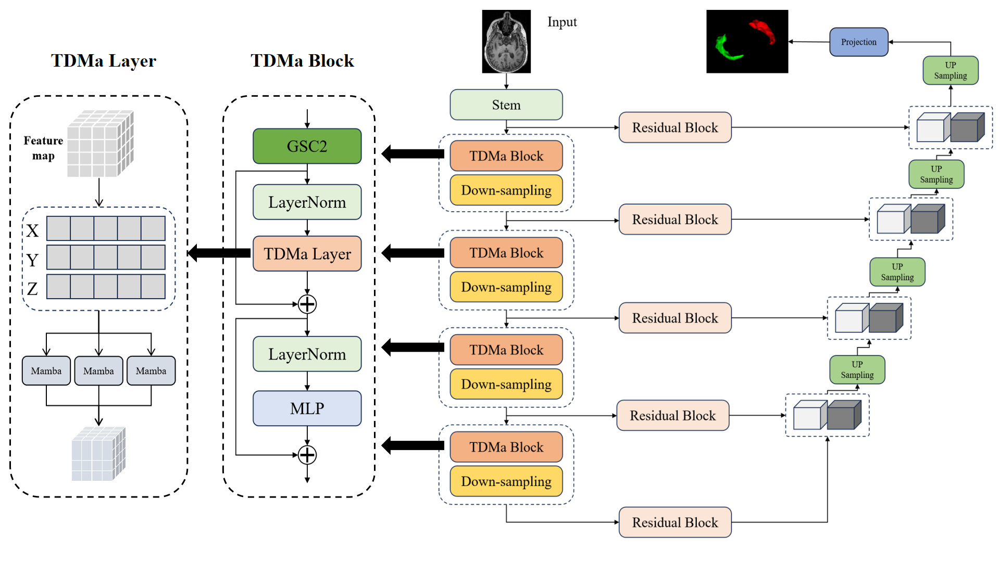

# TMa_UNet : Tri-Directional Mamba U-Net with GSC2

<p align="center">
    <br>
    
    <br>
<p>

<p align="center">
<a href="https://www.bmedesign.cn/#/home">第九届全国大学生生物医学工程创新设计竞赛</a>

## 📖 Table of Contents
- [Introduction](#-introduction)
- [Installation](#%EF%B8%8F-installation)
- [Getting Started](#-getting-started)
- [Result](#-result)


<p align="center">
<a TMa_UNet</a>

## 📝 Introduction
**Topic:**  Automated Segmentation of Hippocampal Region in Brain MRI Images\

In this study, we propose the TMa-UNet model by integrating the Mamba model with the nnU-Net model. By introducing a Tri-Directional Fusion Module and improving the Gate-Space Convolutional Layer, our approach aims to capture global features of the hippocampus in multiple directions, enhancing the model's understanding of spatial relationships between the left and right hippocampal regions. Leveraging the linear complexity of state-space modeling for global feature representation, our method achieves efficient computation while considering global features. Experimental results demonstrate that TMa-UNet achieves an average Dice score of 0.9690 on a custom test set, outperforming the best configuration of nnU-Net with a Dice score of 0.9627.


## 🛠️ Installation

TMa_UNet runs in the Python environment. Here's a recommendation for your project environment:
- Python 3.10
- Torch 2.0.1
- Torchvision 0.15.2
- CUDA 11.8

```bash
# Install causal-conv1d 
cd causal-conv1d
pip install -e .

# Install mamba
cd mamba
pip install -e .

# Install monai 
pip install monai
```

## 🚀 Getting Started

This section introduces basic usage

### Preprocessing

Put data in data/dataset/ 

For example: **data/dataset/AffinedManualSegImageNIfT** 、 **data/dataset/RawImageNIfT**
    
    | AffinedManualSegImageNIfT |   RawImageNIfT  |
    |---------------------------|-----------------|
    |      s001_mask.nii.gz     |   s001.nii.gz   |
    |      s002_mask.nii.gz     |   s001.nii.gz   |
    |      s003_mask.nii.gz     |   s001.nii.gz   |
    |      s004_mask.nii.gz     |   s001.nii.gz   |
    |---------------------------|-----------------|

```bash 
python 1_rename.py

python 2_preprocess.py
```

### Training 

```bash 
python 3_train.py
```

The training logs and checkpoints will be saved in:  **/logs/TMa-UNet**

### Inference 

1. Directly run Use the test set automatically partitioned during training

```bash 
python 4_predict.py
```
2. Use an external dataset:
Run steps 1 and 2 for the test set.

Adjust the parameters of the function **get_train_val_test_loader_from_train**

The function takes several arguments:

    - data_dir: The directory where the data is stored.
    - train_number: The number of samples to be used for training.
    - val_number: The number of samples to be used for validation.
    - test_number: The number of samples to be used for testing.
    
### Evaluation

- Put GT in **prediction_results/GT**

- Run **prediction_results/Evalu.ipynb**

## 🎉 Result
  


## Acknowledgement
Many thanks for these repos for their great contribution!

[https://github.com/ge-xing/SegMamba](https://github.com/ge-xing/SegMamba)

[https://github.com/MIC-DKFZ/nnUNet](https://github.com/MIC-DKFZ/nnUNet)

[https://github.com/Project-MONAI/MONAI](https://github.com/Project-MONAI/MONAI)

[https://github.com/hustvl/Vim](https://github.com/hustvl/Vim)

[https://github.com/bowang-lab/U-Mamba](https://github.com/bowang-lab/U-Mamba)
